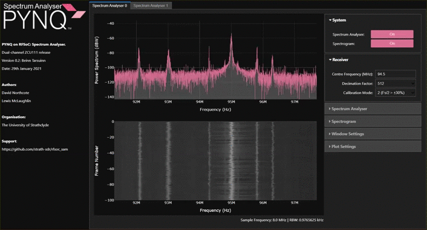

<table border="0" align="center">
    <tr border="0">
        <td align="center" width="50%" border="0">
            
        </td>
        <td align="center" width="50%" border="0">
            <font size=7><b>Available Now!</b></font size> <br> <font size=5>Software Defined Radio with Zynq® UltraScale+ RFSoC</font size> <br> <font size=4><a href="https://rfsocbook.com/">Free Download</a> <br><a href="https://www.amazon.com/Software-Defined-Radio-Ultrascale-RFSoC/dp/1739588606?keywords=zynq+rfsoc&qid=1673452844&sprefix=%2Caps%2C137&sr=8-1&linkCode=ll1&tag=thzybo-20&linkId=0bf245a543fd4af4625086df4c190928&language=en_US&ref_=as_li_ss_tl">Printed Edition</a></font size>
        </td>
    </tr>
</table>

# Spectrum Analyser on PYNQ
This repository hosts an RFSoC Spectrum Analyser tool compatible with [PYNQ image v2.7](https://github.com/Xilinx/PYNQ/releases) for the ZCU111, RFSoC2x2, and RFSoC4x2 development board.

<p align="center">
  
</p>

## Quick Start
Follow the instructions below to install the Spectrum Analyser now. **You will need to give your board access to the internet**.
* Power on your RFSoC development board with an SD Card containing a fresh PYNQ v2.7 image.
* Navigate to Jupyter Labs by opening a browser (preferably Chrome) and connecting to `http://<board_ip_address>:9090/lab`.
* We need to open a terminal in Jupyter Lab. Firstly, open a launcher window as shown in the figure below:

<p align="center">
  
</p>

* Now open a terminal in Jupyter as illustrated below:

<p align="center">
  
</p>

Run the code below in the jupyter terminal to install the Spectrum Analyser.

```sh
pip3 install git+https://github.com/strath-sdr/rfsoc_sam
```

Once installation has complete you will find the Spectrum Analyser notebooks in the Jupyter workspace directory. The folder will be named 'spectrum-analyzer'.

## Using the Project Files
The following software is required to use the project files in this repository.
- Vivado Design Suite 2020.2
- System Generator for DSP
- MATLAB R2020a

### Vivado
This project can be built with Vivado from the command line. Open Vivado 2020.2 and execute the following into the tcl console:
```sh
cd /<repository-location>/boards/<board-name>/rfsoc_sam/
```
Now that we have moved into the correct directory, make the Vivado project by running the make commands below sequentially.
```sh
make block_design
make bitstream
```

Alternatively, you can run the entire project build by executing the following into the tcl console:
```sh
make all
```

## License 
[BSD 3-Clause](../../blob/master/LICENSE)
