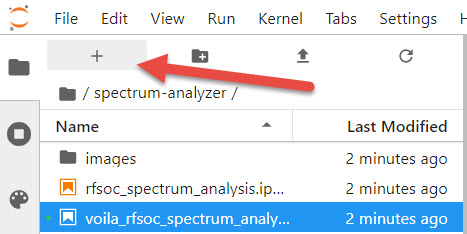

# Spectrum Analyser on PYNQ
This repository hosts an RFSoC Spectrum Analyser tool compatible with [PYNQ image v2.6](https://github.com/Xilinx/PYNQ/releases) for the ZCU111 and RFSoC2x2 development board.

<p align="center">
  
</p>

Currently, this project is in version 0.3.1. We are working on improving aspects of the hardware design and increasing functionality/programability of the Python overlay. 

## Key Features 
* Up to 2 GHz bandwidth for inspection
* Inspect range 0 - 4.096 GHz
* Adaptive bandwidth control and center frequency selection
* Reprogrammable windowing
* Hardware accelerated processing (time domain &rarr; frequency domain &rarr; power spectrum [dB]) 
* PYNQ abstracted allowing Python to interface with the hardware
* [Plotly](https://plot.ly/) visualisation of spectrum and spectrogram (waterfall)
* Simple dashboard for more convenient control/visualisation

<p align="center">
  
</p>

## Quick Start
Follow the instructions below to install the Spectrum Analyser now. **You will need to give your board access to the internet**.
* Power on your RFSoC2x2 or ZCU111 development board with an SD Card containing a fresh PYNQ v2.6 image.
* Navigate to Jupyter Labs by opening a browser (preferably Chrome) and connecting to `http://<board_ip_address>:9090/lab`.
* We need to open a terminal in Jupyter Lab. Firstly, open a launcher window as shown in the figure below:

<p align="center">
  
</p>

* Now open a terminal in Jupyter as illustrated below:

<p align="center">
  
</p>

Now follow the board specific setup instructions as follows. The ZCU111 development board has a more complicated setup than the RFSoC2x2. Please pay particular attention to the steps involved.

## RFSoC2x2 Setup
Your RFSoC2x2 development board already comes preinstalled with the Spectrum Analyser and Voila 0.1.13. Depending on the releases in this repository, we can try to upgrade the Spectrum Analyser package by running the following in the terminal:

```sh
pip3 install https://github.com/strath-sdr/rfsoc_frequency_planner/archive/v0.1.0.tar.gz
pip3 install --force-reinstall --no-deps git+https://github.com/strath-sdr/rfsoc_sam
```

This will forcefully install the latest version of the Spectrum Analyser to your development board. You will find the Spectrum Analyser notebooks in the Jupyter workspace directory. The folder will be named 'spectrum-analyzer'.

## ZCU111 Setup
The ZCU111 image requres a few changes to operate correctly. It is absolutely essential that the xrfdc package is patched. This procedure will overwrite the xrfdc's `__init__.py`. You will not lose any current xrfdc functionality. You will gain thresholding capabilities and fabric read and write register configuration. These are required by the Spectrum Analyser to operate correctly.

**(xrfdc patch)** In the terminal window, run the following script:
```sh
mkdir /home/xilinx/GitHub
cd /home/xilinx/GitHub/
git clone https://github.com/dnorthcote/ZCU111-PYNQ
cd /home/xilinx/GitHub/ZCU111-PYNQ
cp /home/xilinx/GitHub/ZCU111-PYNQ/ZCU111/packages/xrfdc/pkg/xrfdc/__init__.py /usr/local/lib/python3.6/dist-packages/xrfdc/__init__.py
```

**(voila installation)** This repository uses Voila to create simple web applications using Jupyter notebooks. If you would like to use Voila on your ZCU111 development board, simply follow the instructions outlined in this [blog post](https://strath-sdr.github.io/pynq/linux/zynq/fpga/voila/2021/02/22/install-voila-on-pynq-v2-6.html).

**(spectrum-analyser)** This final step will install the Spectrum Analyser to your ZCU111 development board. The Spectrum Analyser does not come preinstalled on the ZCU111 PYNQ image. Run the code below in the jupyter terminal to install the Spectrum Analyser.

```sh
pip3 install git+https://github.com/strath-sdr/rfsoc_sam
```

Once installation has complete you will find the Spectrum Analyser notebooks in the Jupyter workspace directory. The folder will be named 'spectrum-analyzer'.

## Using the Project Files
The following software is required to use the project files in this repository.
- Vivado Design Suite 2020.1
- System Generator for DSP
- MATLAB R2020a

### Vivado
This project can be built with Vivado from the command line. Open Vivado 2020.1 and execute the following into the tcl console:
```sh
cd /<repository-location>/boards/<board-name>/rfsoc_sam/
```
Now that we have moved into the correct directory, make the Vivado project by running the make commands below sequentially.
```sh
make project
make block_design
make bitstream_file
```

Alternatively, you can run the entire project build by executing the following into the tcl console:
```sh
make all
```

## License 
[BSD 3-Clause](../../blob/master/LICENSE)
